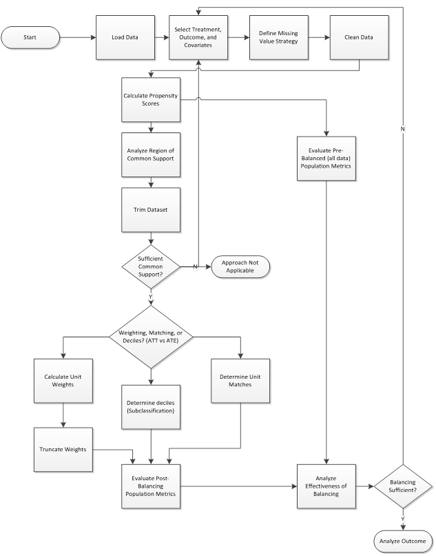
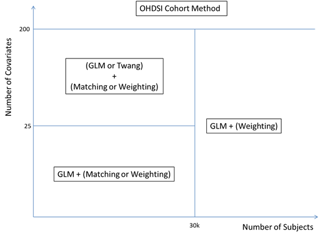
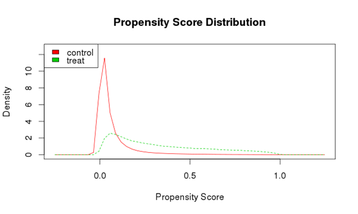
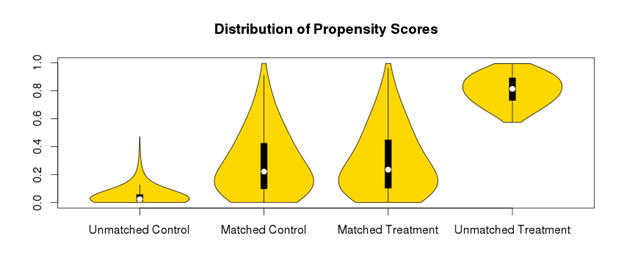
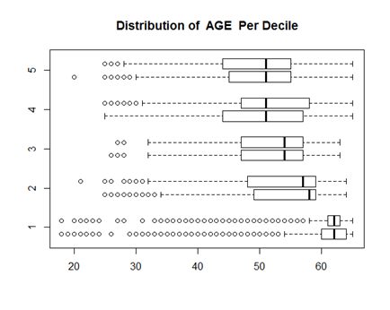

# Centaur

## Introduction

Centaur is an R package for the implementation of observational cohort studies.  It provides several alternative workflows 
to control for observed confounding by providing a set of configurable options to compute propensity scores, balance 
covariates between two exposure groups, evaluate the quality of balance and perform outcome analysis.   

Centaur also uses a more traditional approach than the OHDSI cohort method and places the 
responsibility on the user to include all observed covariates likely to have an impact on the treatment 
choice or the outcome. The cohort data is currently loaded by a user as an R dataframe and can come from any source.  It is therefore left up to the user to design the cohort appropriately.  In contrast, the OHDSI cohort method creates the cohort dataset by a direct configurable query to a CDM instance and then includes all possible exposures, conditions etc as covariates by default.  

At the same time, the OHDSI Cohort Method can also be directly called within Centaur to facilitate 
using regularized regression for cohorts with large numbers of covariates and to compare results 
using different methods to calculate a propensity score.

## Features

* Load any pre-existing cohort file as an R data frame
* Propensity score calculation via logistic regression, generalized boosted models (gbm) which treats interaction terms 
or regularized regression as provided in the OHDSI cohort method
* Coefficients of Propensity score model (for logistic regression)
* Propensity Score Trimming
* Balancing via weighting (either SMR or IPTW), matching, or stratification
* Truncation of weights
* Standard balance diagnostics in tabular and graphical form
* Outcome analysis – either odds ratio or hazards ratio.
* Recommended default options for many steps, but also highly configurable settings

## Features In Progress
* load data via sql query of cdm instance (i.e. replicate
* options to run full workflow with pre-specified settings
* improved plotting

## Workflow Summary

## Screenshots

The default available methods are determined by the number of covariates in the dataset, 
and the total number of subjects. These limits have largely been determined empirically based
 on performance. Depending on your available hardware, it may be feasible to use a given method
 with more (or fewer) covariates and/or subjects. Each of these limits can be overridden.

Simple visual inspection of the area of common support.

"Violin" plots show the distribution of matched and unmatched control and treatment propensity 
scores.

Using the stratification approach, compare the distribution in the treatment/control groups of a single covariate in each strata. 

### Technology

?? R package ??

### System Requirements
System requirements are highly dependent on the size of the dataset being analyzed. For any "real-world"
dataset, we recommend at least a core i7 (or equivalent) and at least 8GB RAM.

### Dependencies
* AUC 
* broom 
* data.table
* dplyr
* ff
* gtools
* Hmisc
* MASS
* MatchIt
* plyr 
* RJDBC
* SDMTools
* sm
* survival 
* twang 
* vioplot 

(list of packages)

### Getting Started
Comping Soon!
Read the whitepaper and
Try the vignette! (Insert link!)

### Installation instructions for various systems

### Getting Involved
### Links to vignette, whitepaper and manual.

### License

### Development

### References
* Centaur Manual	April-2017	
* [An Introduction to Propensity Score Methods for Reducing the Effects of Confounding in Observational Studies, AUSTIN	2011](http://www.tandfonline.com/doi/abs/10.1080/00273171.2011.568786)	
* [Variable Selection for Propensity Score Models](Matching Methods for Causal Inference: A Review and a Look Forward	STUART	2010](https://projecteuclid.org/euclid.ss/1280841730)
* (https://academic.oup.com/aje/article-lookup/doi/10.1093/aje/kwj149)
* [Propensity score estimation with missing values using a multiple imputation missingness pattern(MIMP) approach	LIPKOVICH	2009](http://onlinelibrary.wiley.com/doi/10.1002/sim.3549/full)
* [Reducing Bias in Treatment Effect Estimation in Observational Studies Suffering From Missing Data, HILL	2004](https://academiccommons.columbia.edu/catalog/ac:129151)
* [A comparison of 12 algorithms for matching on the propensity score, AUSTIN,	2014](http://onlinelibrary.wiley.com/doi/10.1002/sim.6004/abstract)
* [Weight Trimming and Propensity Score Weighting,	STUART,	2011](http://journals.plos.org/plosone/article?id=10.1371/journal.pone.0018174)
* [Reducing Bias in Observational Studies Using Subclassification on the Propensity Score	RUBIN	1984](https://www.jstor.org/stable/2288398?seq=1#page_scan_tab_contents)	
* [Using Propensity Scores to Help Design Observational Sutdies: Application to the Tobacco Litigation	RUBIN,	2001](https://rd.springer.com/article/10.1023/A:1020363010465)
* [The performance of different propensity score methods for estimating marginal hazard ratios	AUSTIN	2011](http://onlinelibrary.wiley.com/doi/10.1002/sim.5705/abstract)
* [MatchIt: Nonparametric preprocessing for parametric causal inference HO 2013](http://gking.harvard.edu/matchit)
* [Toolkit for weighting and analysis of nonequivalent groups: a tutorial for the **twang** package](https://cran.r-project.org/web/packages/twang/vignettes/twang.pdf) 
* [The performance of different propensity score methods for estimating marginal odds ratios.	AUSTIN 4	2007](http://onlinelibrary.wiley.com/doi/10.1002/sim.2781/abstract)
* [A Step-by-Step Guide to Propensity Score Matching in R.	BALLOUN	2014](https://www.researchgate.net/publication/290316911_A_step-by-step_guide_to_propensity_score_matching_in_R)	
* [A Practical Guide for Using Propensity Score Weighting in R	GOVINDASAMY	2015](http://pareonline.net/pdf/v20n13.pdf)

### Acknowledgements
The authors acknowledge the following team from AstraZeneca pharmaceuticals,  Robert LoCasale, Michael Goodman, Ramin Arani, Yiduo Zhang, and Sudeep Karve for contributing to the requirements with their expertise in epidemiology, safety informatics, health economics and biostatistics and for reviewing the final product.  The authors also acknowledge Jonathan Herz and Pramod Kumar for help with testing early versions of the package.
